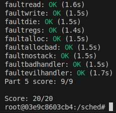

<div align="center">
  <h1>🔄 Fisop Sched</h1>

  <p>
    <strong>Sistemas Operativos (7508) - FIUBA</strong><br>
    Implementación de un Planificador de Procesos (Scheduler) en un Kernel tipo UNIX (JOS).
  </p>

   
   
   
   
  

  <br>

  
  </div>

---

## 📋 Descripción

**Sched** es un proyecto centrado en la implementación del subsistema de planificación de procesos dentro de un kernel académico (JOS). El objetivo principal es extender un kernel básico para soportar multitarea apropiativa, cambio de contexto y diferentes políticas de planificación.

### Características principales

* **Cambio de Contexto:** Implementación en bajo nivel (Assembly x86) para guardar y restaurar el estado de los procesos.

* **Políticas de Planificación:**
  * **Round Robin:** Planificación cíclica equitativa (por defecto).
  * **Prioridades:** Sistema de colas basado en prioridades dinámicas para evitar starvation y favorecer procesos interactivos.

* **System Calls:** Nuevas llamadas al sistema para la gestión de prioridades (*sys_set_priority*, *sys_get_priority*).

## 📝 Respuestas teóricas

El desarrollo teórico, incluyendo el análisis del cambio de contexto con GDB y la justificación de las decisiones de diseño del scheduler de prioridades, se encuentra detallado en el archivo:

* [sched.md](./sched/sched.md)

## 🚀 Compilación y Ejecución

### Compilar

Por defecto, se compilará el kernel utilizando el scheduler Round-Robin.

```bash
make
```

### Compilación condicional de Schedulers

El proyecto permite compilar distintas versiones del kernel según la política de planificación deseada mediante banderas en tiempo de compilación.

- **round-robin**:

```bash
make <target> USE_RR=1
```

- **priorities**:

```bash
make <target> USE_PR=1
```

## Pruebas

El repositorio incluye un script de corrección automática que evalúa tanto el funcionamiento básico del kernel como las políticas de planificación.

Para correr la suite de tests completa:

```bash
make grade
```

## 🐳 Docker

Se provee un script dock que facilita la gestión del entorno de desarrollo encapsulado, asegurando que todas las herramientas (gcc-multilib, qemu, etc.) estén disponibles. El mismo permite la ejecución de los siguientes comandos:

- **build**: genera la imagen del proyecto usando el `Dockerfile` provisto
- **run**: genera un _container_ a partir de la imagen anterior y lo corre
- **exec**: permite abrir una nueva _shell_ en el _container_ anterior

Dentro del _container_ se pueden ejecutar todos los comandos provistos por el `GNUmakefile` como `make grade` o `make qemu-nox`.

El _container_ utiliza [mount volumes](https://docs.docker.com/storage/volumes/) con lo cual los cambios que se realicen por fuera del mismo, serán visibles de forma automática.

## Linter

```bash
$ make format
```

## 👥 Integrantes 

| Integrante | Padrón | Contacto |
| :--- | :---: | :---: |
| **Calderón Vasil, Máximo Augusto** | 111810 | [](https://github.com/maxivasil) [](mailto:mcalderonv@fi.uba.ar) |
| **Molina Buitrago, Steven Marlon** | 112018 | [](https://github.com/StevenMolina22) [](mailto:mmolinab@fi.uba.ar) |
| **Moore, Juan Ignacio** | 112479 | [](https://github.com/JuaniMoore) [](mailto:jmoore@fi.uba.ar) |
| **Tripaldi, Ulises Valentín** | 111919 | [](https://github.com/utripaldi) [](mailto:utripaldi@fi.uba.ar) |
