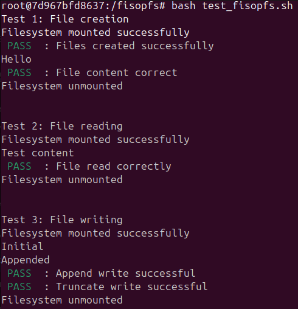

<div align="center">
  <h1>💾 FisopFS</h1>

  <p>
    <strong>Sistemas Operativos (7508) - FIUBA</strong><br>
    Implementación de un Sistema de Archivos en espacio de usuario utilizando <strong>FUSE</strong>.
  </p>

  
  
  
  

  <br>

  
  </div>

---

## 📋 Descripción

**FisopFS** es un sistema de archivos implementado sobre FUSE (Filesystem in Userspace) que simula un disco en memoria con capacidad de persistencia. El proyecto permite realizar operaciones estándar de archivos (crear, leer, escribir, borrar) y directorios, manteniendo la estructura de datos en memoria y serializándola a disco al finalizar.

### Características principales
* **Estructura en Memoria:** Utiliza un array estático de inodos para representar archivos y directorios.
* **Persistencia:** Capacidad de guardar el estado del sistema de archivos en un archivo binario (`.fisopfs`) y recuperarlo en el siguiente montaje.
* **Interfaz POSIX:** Compatible con comandos estándar de terminal (`ls`, `touch`, `mkdir`, `cat`, etc.).

## 📝 Respuestas teóricas

El desarrollo teórico, incluyendo las estructuras de datos elegidas y las decisiones de diseño, se encuentra detallado en el archivo:
* [fisopfs.md](./fisopfs.md)

## 🚀 Compilación y Ejecución

### Compilar

Para generar el binario del sistema de archivos:

```bash
$ make
```

### Ejecutar

#### Setup

Primero hay que crear un directorio de prueba:

```bash
$ mkdir prueba
```

#### Iniciar el servidor FUSE

En el mismo directorio que se utilizó para compilar la solución, ejectuar:

```bash
$ ./fisopfs prueba/
```

**Opciones de Persistencia:** Por defecto, el sistema guarda los datos en persistence_file.fisopfs. Puedes especificar un archivo personalizado con el flag --filedisk:

```bash
$ ./fisopfs prueba/ --filedisk nuevo_disco.fisopfs
```

#### Verificar directorio

```bash
$ mount | grep fisopfs
```

### Utilizar el directorio de "pruebas"

El repositorio cuenta con un script de pruebas automatizado (test_fisopfs.sh) que verifica las funcionalidades críticas: creación de archivos, lectura/escritura, persistencia y manejo de directorios.

En otra terminal, ejecutar:

```bash
$ cd prueba
$ ls -al
```

### Limpieza

Para desmontar el sistema de archivos y asegurar que los datos se guarden en el archivo de persistencia:

```bash
$ sudo umount prueba
```

## 🐳 Docker

Existen tres _targets_ en el archivo `Makefile` para utilizar _docker_.

- `docker-build`: genera la imagen basada en "Ubuntu 20.04" con las dependencias de FUSE
- `docker-run`: crea un _container_ basado en la imagen anterior ejecutando `bash`
   - acá se puede ejecutar `make` y luego `./fisopfs -f ./prueba`
- `docker-exec`: permite vincularse al mismo _container_ anterior para poder realizar pruebas
   - acá se puede ingresar al directorio `prueba`

## Linter

```bash
$ make format
```

Para efectivamente subir los cambios producidos por el `format`, hay que `git add .` y `git commit`.

## 👥 Integrantes 

| Integrante | Padrón | Contacto |
| :--- | :---: | :---: |
| **Calderón Vasil, Máximo Augusto** | 111810 | [](https://github.com/maxivasil) [](mailto:mcalderonv@fi.uba.ar) |
| **Molina Buitrago, Steven Marlon** | 112018 | [](https://github.com/StevenMolina22) [](mailto:mmolinab@fi.uba.ar) |
| **Moore, Juan Ignacio** | 112479 | [](https://github.com/JuaniMoore) [](mailto:jmoore@fi.uba.ar) |
| **Tripaldi, Ulises Valentín** | 111919 | [](https://github.com/utripaldi) [](mailto:utripaldi@fi.uba.ar) |
