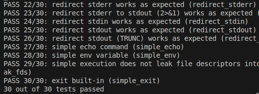

<div align="center">
  <h1>🐚 Shell</h1>
  <p>
    <strong>Sistemas Operativos (7508) - FIUBA</strong><br>
    Implementación de un Intérprete de Comandos (Shell) estilo <strong>UNIX</strong>.
  </p>

   
   
   
  

  <br>

  

  </div>

---

## 📋 Descripción

Este proyecto consiste en la implementación de una Shell interactiva compatible con estándares POSIX básicos. El programa es capaz de interpretar comandos ingresados por el usuario, gestionar procesos y manipular la entrada/salida estándar.

### Características principales

* **Ejecución de programas:** Lanzamiento de binarios y comandos del sistema (ej: ls, grep, echo).

* **Redirecciones:** Manejo de flujo de entrada (<) y salida (>).

* **Tuberías (Pipes):** Comunicación entre procesos mediante el operador |.

* **Procesos en segundo plano:** Ejecución asíncrona utilizando el operador &.

* **Built-ins:** Comandos internos como cd y exit.

## 📝 Respuestas teóricas

El desarrollo teórico y las explicaciones sobre el funcionamiento interno (ciclo de vida de procesos, syscalls utilizadas como fork, exec, pipe, dup) se encuentran en:
* [shell.md](./shell/shell.md)

## 🚀 Compilación y Ejecución

### Compilar

Para generar el ejecutable de la shell:

```bash
make
```

### Ejecutar

Una vez compilado, se puede iniciar el intérprete con:

```bash
./sh
```

## 🧪 Pruebas

El proyecto cuenta con una suite de pruebas automatizadas para verificar el correcto funcionamiento de las distintas funcionalidades.

- Ejecutar todas las pruebas

```bash
make test
```

- Ejecutar una **única** prueba

```bash
make test-TEST_NAME
```

Por ejemplo:

```bash
make test-env_empty_variable
```

Cada identificador de una prueba se muestra entre paréntesis `(TEST_NAME)` al lado de cada _test_ cuando se ejecutan todas las pruebas.

## 🐳 Docker

Se provee un script dock para encapsular el entorno de desarrollo y pruebas.

- **Build:** Genera la imagen con las herramientas necesarias.
    ```bash
    ./dock build
    ```
- **Run:** Inicia el contenedor y abre una terminal.
    ```bash
    ./dock run
    ```
- **Exec:** Abre una nueva sesión en un contenedor ya activo.
    ```bash
    ./dock exec
    ```

Dentro del contenedor se pueden ejecutar make, make test y ./sh con el entorno garantizado.

## Linter

```bash
make format
```

## 👥 Integrantes 

| Integrante | Padrón | Contacto |
| :--- | :---: | :---: |
| **Calderón Vasil, Máximo Augusto** | 111810 | [](https://github.com/maxivasil) [](mailto:mcalderonv@fi.uba.ar) |
| **Molina Buitrago, Steven Marlon** | 112018 | [](https://github.com/StevenMolina22) [](mailto:mmolinab@fi.uba.ar) |
| **Moore, Juan Ignacio** | 112479 | [](https://github.com/JuaniMoore) [](mailto:jmoore@fi.uba.ar) |
| **Tripaldi, Ulises Valentín** | 111919 | [](https://github.com/utripaldi) [](mailto:utripaldi@fi.uba.ar) |