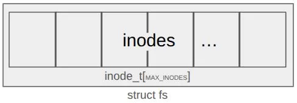
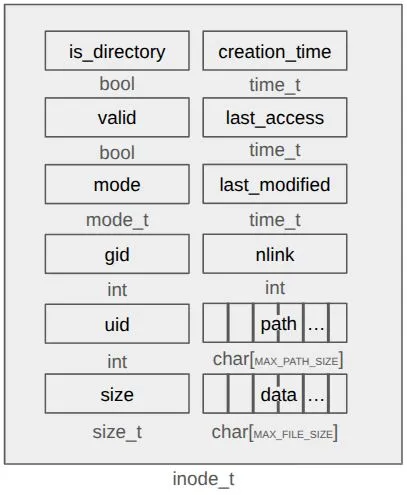

# fisop-fs

## Estructuras en memoria

Para la representación del file system en general usamos un struct fs, compuesto por un array de 1024 inodes. Dichos inodes se utilizan ya sea para representar archivos o directorios.

Todas las constantes (MAX_INODES, MAX_PATH_SIZE, MAX_FILE_SIZE) fueron definidas para utilizar memoria estatica con el fin de facilitar el menejo de la misma.

```c
struct fs
{
    inode_t inodes[MAX_INODES];
};
```

### Inode

Cada Inode contiene la metadata necesaria de cada archivo/directorio y los datos que contiene el mismo (los directorios no contienen data):

```c
typedef struct inode
{
    bool is_directory;
    bool valid;
    mode_t mode;
    int gid;
    int uid;
    size_t size;
    time_t creation_time;
    time_t last_access;
    time_t last_modified;
    int nlink;
    char path[MAX_PATH_SIZE];
    char data[MAX_FILE_SIZE];
} inode_t;
```

**Metadata:**

| Clave         | Valor                                                       |
| ------------- | ----------------------------------------------------------- |
| is_directory  | flag que indica si es archivo o directorio                  |
| valid         | flag que indica si el inodo es válido, o sea está en uso    |
| mode          | flag que indica el modo del inodo (lectura, escritura, etc) |
| gid           | group id                                                    |
| uid           | user id                                                     |
| size          | tamaño de los datos que contiene                            |
| creation_time | fecha en que se creo                                        |
| last_access   | indica la última vez que se accedió al archivo accedió      |
| last_modified | indica la ultima fecha en que se modificó                   |
| path          | ruta absoluta del archivo o directorio                      |

### Diagramas

En los siguiente diagramas se puede ver como se dispone en memoria `inode_t` y `struct fs`.






## Busqueda de un archivo

Para encontrar un archivo en específico mediante su path se implementó la función get_inode_index, la cual recorre todos los inodos del file system en busqueda del que sea válido y coincida su path con la que se busca. En caso de existir se devuelve el índice de dicho inodo, en caso contrario -1.

## Persistencia del file system en disco

Cuando se inicia el file system, de haberse indicado la flag `--filedisk` seguida de una ruta para persistir el filesystem, o bien si existe el archivo persistence_file.fisopfs, se carga en memoria el filesystem que contenía el archivo. Cuando se ejecuta el destroy, se escribe en el archivo de persistencia toda la informacion que contiene el file system y se asegura su persistencia con `fflush`.

## Tests

Implementamos una serie de pruebas que testean todas las funcionalidades requeridas. Para su compilación y ejecución debemos estar situados en el directorio fisopfs.

### Compilación y ejecución

```sh
    make docker-run
    make
    bash test_fisopfs.sh
```

### Resultados

```sh
    Test 1: File creation
    Filesystem mounted successfully
    PASS  : Files created successfully
    Hello
    PASS  : File content correct
    Filesystem unmounted


    Test 2: File reading
    Filesystem mounted successfully
    Test content
    PASS  : File read correctly
    Filesystem unmounted


    Test 3: File writing
    Filesystem mounted successfully
    Initial
    Appended
    PASS  : Append write successful
    PASS  : Truncate write successful
    Filesystem unmounted


    Test 4: File deletion
    Filesystem mounted successfully
    PASS : File deleted successfully
    Filesystem unmounted


    Test 5: Directory creation
    Filesystem mounted successfully
    PASS : Directory created successfully
    Filesystem unmounted


    Test 6: Directory listing
    Filesystem mounted successfully
    total 0
    drwxr-xr-x 1 root root 0 May 31 01:38 .
    drwxr-xr-x 1 root root 0 May 31 01:38 ..
    -rw-r--r-- 0 root root 0 May 31 01:38 file1.txt
    PASS : Directory listing includes . and ..
    Filesystem unmounted


    Test 7: Directory deletion
    Filesystem mounted successfully
    PASS : Empty directory deleted successfully
    PASS : Non-empty directory deletion failed as expected
    Filesystem unmounted


    Test 8: Binary file handling
    Filesystem mounted successfully
    PASS : Binary file handled correctly
    Filesystem unmounted


    Test 9: Persistence
    Filesystem mounted successfully
    Filesystem unmounted
    Filesystem mounted successfully
    PASS : Data persisted across mounts
    Filesystem unmounted
```
