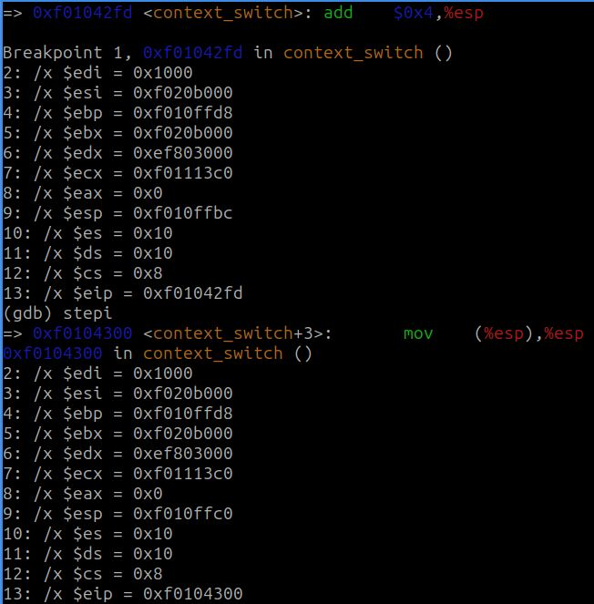
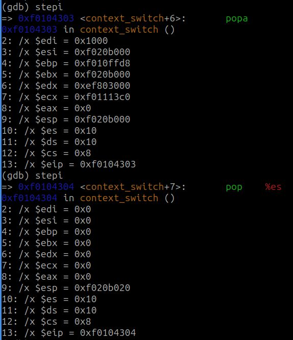
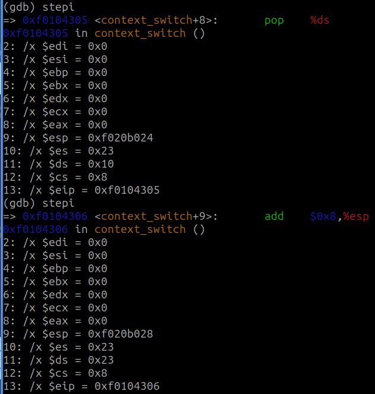
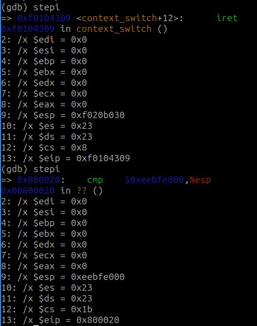

# sched

## Seguimiento cambio de contexto con GDB

priorities

## Política de scheduling con prioridades

Primero definimos las prioridades con tres tipos: 0; 1; 2, siendo 0 la prioridad más alta.

Todos los procesos comienzan con prioridad 0, la cual puede ser modificada por el usuario mediante el uso de la syscall `sys_set_priority()`. Asimismo, creamos la syscall `sys_get_priority()` para obtener la prioridad de un proceso en particular. 

El scheduler con prioridades que implementamos, consiste en recorrer los procesos y guardar en el `struct Env *next[]`, para cada prioridad, el que se encuentre con la posibilidad de enviarlo a correr y tenga la menor cantidad de `env_runs`. Entonces, para cada proceso no NULL seleccionado, se corre el de mayor prioridad (el menor número entero) siempre y cuando las variables globales priority_$N_runs sea menor que las constantes globales `MAX_RUNS_PRIORITY_$N` (siendo $N el número de prioridad). Si ningun proceso seleccionado se puede correr, se corre el proceso actual, de estar en estado ENV_RUNNING. 

Una vez que todos los `priority_$N_runs` alcanzan las `MAX_RUNS_PRIORITY_$N` ó cuando se quiere ejecutar un proceso de menor prioridad, y los de mayor prioridad están disponibles pero han alcanzado su cuota máxima, se reinician los `priority_$N_runs` a cero, dando la posibilidad de ejecutar procesos de prioridades altas que estaban estáticos y evitando el `sched_halt` cuando hay algún proceso disponible para correr.

