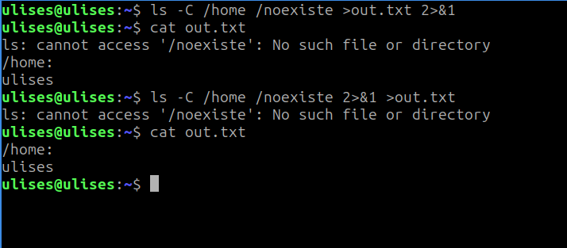

# shell

### Búsqueda en $PATH
-> Responder: ¿cuáles son las diferencias entre la syscall execve(2) y la familia de wrappers proporcionados por la librería estándar de C (libc) exec(3)?

La principal diferencia entre la syscall execve(2) y los wrappers de libc exec(3) es el nivel de abstracción. Es decir que la syscall interactua directamente con en kernel, mientras que los wrappers son un intermediario entre el usuario y el kernel. 

Los wrappers de libc son invocados por el usuario, y según las letras en las que termine le agrega, a los parámetros enviados por el usuario, otros más para luego sí llamar a execve(2). 

En cambio, cuando el usuario utiliza la syscall es él mismo quien se tiene que encargar de enviar todos los parámetros necesarios. 

## letras e, p, l

-> Responder: ¿Puede la llamada a exec(3) fallar? ¿Cómo se comporta la implementación de la shell en ese caso?

Sí, puede fallar y devuelve -1, especificando el error en **errno**. Nuestra implementación, en ese caso imprime dicho error y termina el proceso con **exit_code** -1.

---

### Procesos en segundo plano
-> Responder: Investigar el significado de 2>&1, explicar cómo funciona su forma general

El fragmento 2>&1 es parte de la redirección de flujos en shells como bash. Se utiliza para redirigir la salida de error estándar (stderr) al mismo lugar que la salida estándar (stdout). 
Se está redirigiendo a donde 1 apunta en ese momento (por eso el &, que indica "referencia a"). El 1 apunta a la salida estándar, mientras que el 2 a la salida de erorres estándar.

- Mostrar qué sucede con la salida de cat out.txt en el ejemplo.
Luego repetirlo, invirtiendo el orden de las redirecciones (es decir, 2>&1 >out.txt). ¿Cambió algo? Compararlo con el comportamiento en bash(1).

    En ambos casos, la salida de cat out.txt es la siguiente:

    ```shell
    ls: cannot access '/noexiste': No such file or directory
    /home:
    ulises
    ```
    
    No cambió nada al invertir el orden de las redirecciones, ya que nuestra shell primero se ocupa de verificar las redirecciones de salida y luego la del error. 

    

    Comparandolo con el comportamiento en bash(1), aquí sí importa el orden de las redirecciones, como se ve en la foto.

    

---

### Flujo estándar

---

### Tuberías múltiples

---

### Variables de entorno temporarias

Responder: ¿Por qué es necesario hacerlo luego de la llamada a fork(2)?

Es necesario hacerlo luego de la llamada a fork(2) para que solo cambie el entorno de la ejecución de ese proceso. Si lo hicieramos antes, el hijo heredaría las variables de entorno temporarias del padre, lo cual no queremos que suceda.

Responder: En algunos de los wrappers de la familia de funciones de exec(3) (las que finalizan con la letra e), se les puede pasar un tercer argumento (o una lista de argumentos dependiendo del caso), con nuevas variables de entorno para la ejecución de ese proceso. Supongamos, entonces, que en vez de utilizar setenv(3) por cada una de las variables, se guardan en un arreglo y se lo coloca en el tercer argumento de una de las funciones de exec(3).

¿El comportamiento resultante es el mismo que en el primer caso? Explicar qué sucede y por qué.
Describir brevemente (sin implementar) una posible implementación para que el comportamiento sea el mismo.

No, el comportamiento no es exactamente el mismo si se usan funciones exec de la familia execle() o execve() pasando un arreglo de variables de entorno en lugar de usar setenv() previamente.
- Uso de setenv():
    Las variables de entorno se modifican en el proceso actual.
    Cuando luego se llama a una función exec() (como execlp() o execvp()), el nuevo proceso hereda automáticamente el entorno del proceso original (ya modificado).
    Es más simple si se quiere agregar o modificar unas pocas variables sin tocar el entorno completo.
- Uso de execle() o execve() con arreglo de entorno:
    Las funciones execle() y execve() permiten pasar un entorno completamente nuevo al proceso reemplazado.
    Si no se incluye una copia completa del entorno original más las nuevas variables, el nuevo proceso puede arrancar con un entorno diferente o incompleto (por ejemplo, sin PATH, HOME, etc.).
    El entorno del proceso padre no se modifica.
- Mismo comportamiento:
    No, salvo que se copie explícitamente el entorno original, o se modifique con las nuevas variables, y luego se pase ese entorno modificado como tercer argumento de execle() o execve(). De lo contrario, se estaría eliminando implícitamente todo el entorno original.
    Una posible forma de replicar el comportamiento de setenv() sería:
    Obtener el entorno actual del proceso, por ejemplo, desde la variable global environ.
    Copiar ese entorno a un nuevo arreglo de strings.
    Agregar o modificar las variables necesarias dentro de ese arreglo.
    Pasar ese nuevo arreglo como el tercer argumento a execve() o execle().
    
---

### Pseudo-variables

Responder: Investigar al menos otras tres variables mágicas estándar, y describir su propósito.

    Incluir un ejemplo de su uso en bash (u otra terminal similar).

\$$

\$#

\$@ ------ $*

\$0

\$! --- pid ultimo en back


---

### Comandos built-in

---

### Historial

---
